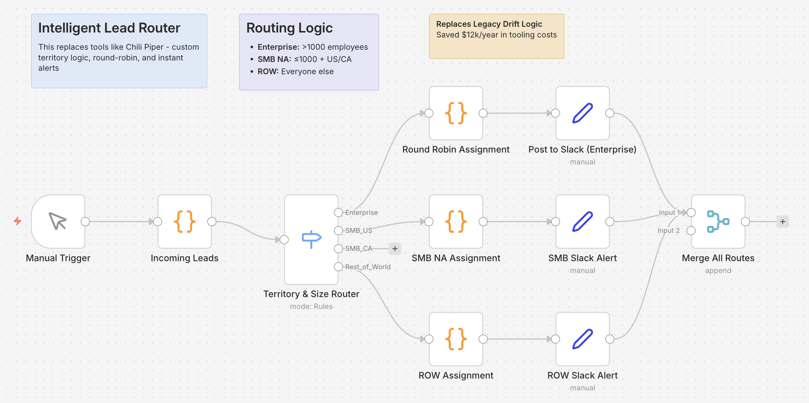

# n8n Automation Showcase

**3 production-ready workflow patterns** demonstrating how n8n can replace expensive SaaS tools while delivering the same (or better) functionality.

> These are MVP/showcase workflows built for demonstration purposes. They use mock data inputs to ensure reliable execution during live demos without requiring external API connections.

---

## Workflows

### 1. DIY Enrichment Engine
**Replaces:** ZoomInfo, Clearbit, Apollo enrichment ($15k+/year)  
**Cost:** ~$0.002 per enrichment vs $0.50 per ZoomInfo credit

**What it does:**
- Takes company domains as input
- AI enriches with industry, ICP fit, revenue range, and pricing model
- Formats data for CRM update (HubSpot-ready structure)

**Business Value:** 99.6% cost reduction on data enrichment. A team doing 10,000 enrichments/month saves ~$5,000/month.

---

### 2. Intelligent Lead Router
**Replaces:** Chili Piper, Drift routing, LeanData ($12k+/year)  
**Cost:** $0 (runs on your n8n instance)

**What it does:**
- Routes leads by company size + geographic territory
- Enterprise (>1000 employees) → Round-robin to Account Executives
- SMB North America → Regional reps by territory
- Rest of World → EMEA/APAC split
- Generates Slack-formatted assignment alerts

**Business Value:** Instant lead routing with zero per-seat licensing. Scales infinitely without additional cost.

---

### 3. Data Sanitizer
**Replaces:** Manual data cleanup, expensive data quality tools  
**Cost:** ~$0.001 per record

**What it does:**
- Takes messy, inconsistent job titles from your CRM
- AI classifies into standardized tiers (C-Suite, VP, Director, Manager, IC)
- Flags decision-makers for sales prioritization
- Configurable tiers - change once, AI adapts automatically

**Business Value:** Clean, consistent data for segmentation and reporting. Identifies decision-makers automatically for sales prioritization.

---

## Installation

### Prerequisites
- Self-hosted n8n instance (or n8n Cloud)
- OpenAI API key (for AI-powered workflows)

### Import Steps
1. Download the workflow JSON files from `/workflows/`
2. In n8n, go to **Workflows** → **Add Workflow** → **Import from File**
3. Select the JSON file and import
4. Configure your OpenAI credentials in the AI nodes
5. Activate the workflow

---

## Technical Highlights

- **Mock Data Pattern:** All workflows use Code nodes to simulate inputs, ensuring reliable demos without external dependencies
- **AI Integration:** GPT-4o-mini for cost-effective, fast processing
- **Modular Design:** Each workflow can be extended or connected to real integrations
- **Production-Ready Structure:** Proper error handling patterns and clear node organization

---

## Customization

These workflows are designed as starting points. To connect to real systems:

1. **Enrichment Engine:** Replace mock input with HTTP Request to your lead source, add real HubSpot/Salesforce node
2. **Lead Router:** Connect webhook trigger to your form/CRM, replace Slack mock with real Slack node
3. **Data Sanitizer:** Add HTTP Request to pull from your CRM, connect output to CRM update node

---

## About

Built by **Farkhod Fayzullaev** to demonstrate RevOps automation patterns using n8n.

These workflows showcase the cost-saving potential of self-hosted automation vs. expensive SaaS subscriptions.

---

## License

MIT - Feel free to use, modify, and adapt these workflows for your own projects.
