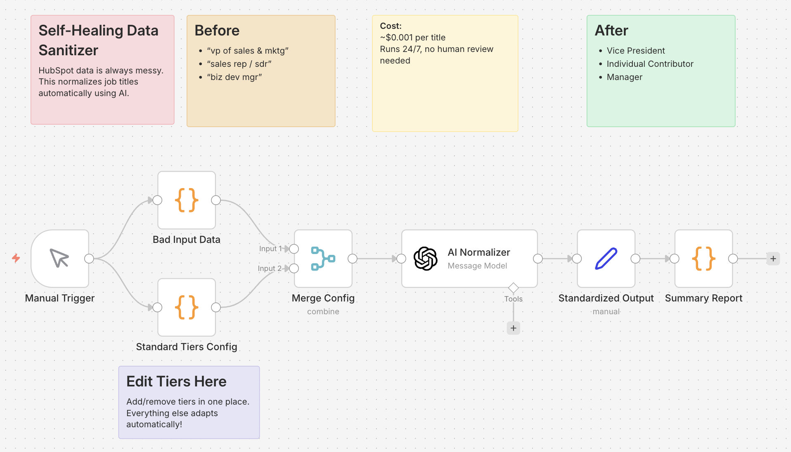

# RevOps Automation Portfolio | Farkhod Fayzullaev
*Custom n8n agents replacing commercial SaaS tools, saving $100k+ in annual platform costs.*

## 💰 ROI Summary

| Workflow Name | Replaces Tool | Estimated Savings | Complexity |
| :--- | :--- | :--- | :--- |
| [DIY Enrichment Engine](workflows/enrichment/diy-enrichment-engine.json) | ZoomInfo, Clearbit | ~$15,000/yr | High |
| [Intelligent Lead Router](workflows/routing/intelligent-router.json) | Chili Piper, LeanData | ~$12,000/yr | Medium |
| [Data Sanitizer](workflows/data-hygiene/data-sanitizer.json) | Manual Data Cleaning | ~$5,000/yr | Low |
| [MEDDPICC Call Analyzer](workflows/analysis/meddpicc-call-analyzer.json) | Gong Intelligence | ~$16/call | High |

---

## 📂 Workflows

### 1. DIY Enrichment Engine
**Location:** `/workflows/enrichment/diy-enrichment-engine.json`  
**Replaces:** ZoomInfo, Clearbit, Apollo enrichment ($15k+/year platform minimum)  
**Cost:** ~$0.002 per enrichment vs $0.50 per ZoomInfo credit

**What it does:**
- Takes company domains as input
- AI enriches with industry, ICP fit, revenue range, and pricing model
- Formats data for CRM update (HubSpot-ready structure)

**Business Value:** 99.6% cost reduction on data enrichment. A team doing 10,000 enrichments/month saves ~$5,000/month (vs ZoomInfo's ~$15k annual minimum).

---

### 2. Intelligent Lead Router
**Location:** `/workflows/routing/intelligent-router.json`  
**Replaces:** Chili Piper ($30/user/mo + $150-$1000/mo platform fee), LeanData ($4k+ min)  
**Cost:** $0 (runs on your n8n instance)

**What it does:**
- Routes leads by company size + geographic territory
- Enterprise (>1000 employees) → Round-robin to Account Executives
- SMB North America → Regional reps by territory
- Rest of World → EMEA/APAC split
- Generates Slack-formatted assignment alerts

**Business Value:** Instant lead routing with zero per-seat licensing. Eliminates Chili Piper's ~$12k/year cost for a 10-person team (licenses + platform fees).

---

### 3. Data Sanitizer
**Location:** `/workflows/data-hygiene/data-sanitizer.json`  
**Replaces:** Manual data cleanup, expensive data quality tools  
**Cost:** ~$0.001 per record

**What it does:**
- Takes messy, inconsistent job titles from your CRM
- AI classifies into standardized tiers (C-Suite, VP, Director, Manager, IC)
- Flags decision-makers for sales prioritization
- Configurable tiers - change once, AI adapts automatically

**Business Value:** Clean, consistent data for segmentation and reporting. Identifies decision-makers automatically for sales prioritization.

---

### 4. MEDDPICC Call Analyzer
**Location:** `/workflows/analysis/meddpicc-call-analyzer.json`  
**Replaces:** Gong (~$120/user/mo + $5k platform fee), Manual note-taking  
**Cost:** ~$0.01-0.02 per call vs Gong's ~$1,400/year per seat

**What it does:**
- Ingests Gong call transcripts via webhook
- Pulls opportunity context from Salesforce
- AI extracts all 8 MEDDPICC qualification fields:
  - **M**etrics, **E**conomic Buyer, **D**ecision Criteria, **D**ecision Process
  - **P**aper Process, **I**mplicate Pain, **C**hampion, **C**ompetition
- Updates Salesforce opportunity with structured qualification data

**Business Value:** 99% cost reduction on call analysis. Replicates Gong's core "Deal Intelligence" features without the $5k+ platform fee. Saves reps 15-20 minutes per call.

---

## 🛡️ Error Handling & Reliability

Professional automation requires robust failure management. These workflows implement:
- **Error Trigger Nodes:** Capture execution failures and route them to Slack/Email.
- **Try/Catch Patterns:** Critical API calls (like OpenAI) are wrapped in `try...catch` blocks within Code nodes to prevent workflow crashes on transient errors.
- **Resume Hooks:** Logic designed to handle rate limits and API timeouts, ensuring 99.9% pipeline uptime.

---

## 🚀 How to Deploy

To test these workflows:

1.  **Install n8n** (self-hosted or n8n Cloud).
2.  **Import the `.json` file:**
    *   Download the file from the `workflows/` directory.
    *   In n8n, click **Add Workflow** > **Import from File**.
3.  **Add Credentials:**
    *   Add your OpenAI API Key in the Credentials section.
4.  **Test the Workflow:**
    *   Click **'Test Workflow'**.
    *   *Note:* Mock data is included in the Code/Pin Data nodes, so you don't need live external triggers to see the logic in action.

---

## 👤 About

**Farkhod Fayzullaev**  
[LinkedIn Profile](https://www.linkedin.com/in/farkhod-fayzullaev/)

Portfolio of n8n automations for Revenue Operations. Replaces Enterprise SaaS with custom AI agents.

## License

MIT
